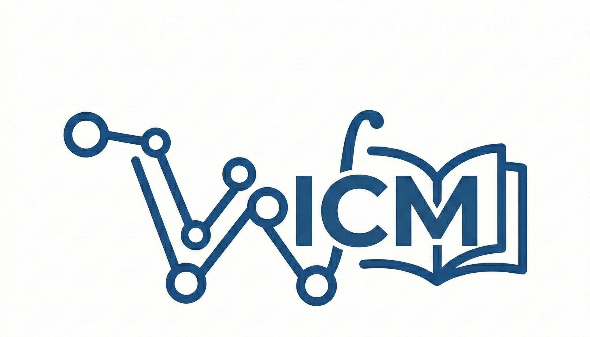

#  :material-book: Wiki-ICM 

  

---

Bienvenido a **Wiki-ICM**, un proyecto que busca recopilar apuntes, listados y material de la carrera **Ingeniería Civil Matemática UdeC**.

---

## 📂 Contenido

Los recursos están organizados siguiendo la malla curricular de la carrera:

* :material-school: **Malla Ingeniería Civil Matemática:** Apuntes, guías, certámenes pasados y libros  🛠 
* :material-plus-box: **Recursos Adicionales:** Otros ramos electivos o de otras carreras relacionadas.

---

## 🤝 ¿Cómo puedo ser parte?

Por el momento estamos iniciando, así que si tienes material útil, sugerencias o quieres ser parte del equipo de trabajo, puedes contactarnos a:

* 📧 [jjunemann2024@udec.cl](mailto:jjunemann2024@udec.cl)
* 📧 [bsandoval2018@udec.cl](mailto:bsandoval2018@udec.cl)
* 📧 [pnahuelquin2024@udec.cl](mailto:pnahuelquin2024@udec.cl)

y el weon del **TANO** 
